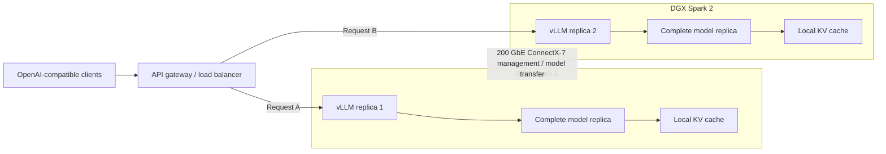
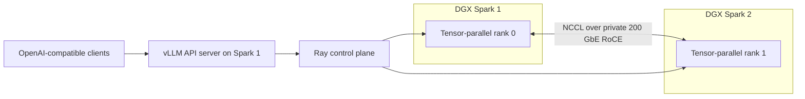

### 1. Best Throughput: Two Independent Replicas

This is the preferred architecture when the model, KV cache, and runtime overhead fit within one Spark. Examples include most 7B–32B models and quantized 70B models.



Advantages:

- Nearly doubles aggregate request throughput.
- No collective communication during generation.
- A failure only removes half the capacity.
- Each replica maintains an independent KV cache.
- Upgrades can be performed one node at a time.

Run one vLLM container per Spark and place HAProxy, Envoy, NGINX, or another OpenAI-aware router in front. Prefer queue-depth-aware routing; otherwise use least-connections. Sticky routing by prompt or tenant can improve automatic prefix-cache reuse.

For a dedicated server, start around:

```bash
vllm serve "$MODEL" \
  --host 0.0.0.0 \
  --port 8000 \
  --gpu-memory-utilization 0.85 \
  --max-model-len 8192 \
  --enable-prefix-caching
```

Use model-specific settings from the [DGX Spark vLLM recipes](https://recipes.vllm.ai/browse?panel=open&hw=dgx_spark_gb10).

### 2. Large Model: One Distributed TP=2 Replica

Use this only when one complete model cannot fit comfortably within one Spark.



NVIDIA’s currently validated DGX Spark recipe uses:

```bash
vllm serve meta-llama/Llama-3.3-70B-Instruct \
  --tensor-parallel-size 2 \
  --max-model-len 2048 \
  --distributed-executor-backend ray
```

Run identical pinned containers on both nodes. NVIDIA’s current playbook specifies `nvcr.io/nvidia/vllm:26.05-py3`; if using the available `26.05.post1-py3` image, pin the same image digest on both systems and verify the recipe against that version.

Configure all distributed traffic on the private QSFP network:

```bash
VLLM_HOST_IP=<node-specific-QSFP-IP>
UCX_NET_DEVICES=<QSFP-interface>
NCCL_SOCKET_IFNAME=<QSFP-interface>
GLOO_SOCKET_IFNAME=<QSFP-interface>
TP_SOCKET_IFNAME=<QSFP-interface>
```

The Ray dashboard and Ray ports must not be exposed to an untrusted LAN. vLLM explicitly warns that distributed control traffic is unencrypted and unsafe on a public network.

**My Recommendation**

Start with these three benchmark configurations:

| Test | Deployment | Purpose |
|---|---|---|
| A | One Spark, one replica | Establish baseline |
| B | Two Sparks, two independent replicas | Measure maximum serving throughput |
| C | Two Sparks, Ray + TP=2 | Test models larger than one node |

For Test C, use NVIDIA’s validated TP=2 design first. Also benchmark `pipeline-parallel-size=2` with `tensor-parallel-size=1` if supported by your chosen model. Generic vLLM guidance favors pipeline parallelism across node boundaries because it performs fewer frequent collectives, but NVIDIA’s Spark-specific recipe currently validates TP=2. The measured TTFT and inter-token latency should decide.

Capture:

- Time to first token, p50/p95/p99
- Inter-token latency
- Output tokens/second per request
- Aggregate output tokens/second
- Requests/second
- KV-cache utilization
- Maximum stable concurrency
- NCCL transport and network throughput

Run once with `NCCL_DEBUG=INFO`. Confirm that the selected high-speed interface is used and that communication is not falling back to an ordinary LAN interface. The ideal evidence is an RDMA/IB transport rather than `NET/Socket`.

**Important Capacity Guidance**

- Do not span both Sparks merely because both are available.
- Leave memory headroom for KV cache; model weights consuming almost all 256 GB will produce a poor server.
- NVIDIA labels 405B INT4 on two Sparks as testing-only, with insufficient production memory headroom.
- For normal online serving, a quantized model replicated once per Spark will usually outperform the same model sharded across both.
- Keep the model cache local on each Spark. Do not load weights repeatedly over NFS during startup.
- Begin with realistic context limits such as 8K or 16K. Advertising 128K unnecessarily can consume substantial KV-cache capacity.

**Official References**

- [NVIDIA: Serve LLMs with vLLM on DGX Spark](https://build.nvidia.com/spark/vllm)
- [NVIDIA: Multi-node vLLM serving](https://build.nvidia.com/spark/vllm/multi-node.md)
- [NVIDIA: Connect two DGX Sparks](https://build.nvidia.com/spark/connect-two-sparks)
- [NVIDIA: ConnectX-7 networking](https://docs.nvidia.com/dgx/dgx-spark/spark-clustering.html)
- [vLLM: Parallelism and scaling](https://docs.vllm.ai/en/stable/serving/parallelism_scaling/)
- [vLLM: Data-parallel deployment](https://docs.vllm.ai/en/stable/serving/data_parallel_deployment/)

The final choice depends primarily on the exact model, quantization, expected context length, concurrency, and whether you optimize for latency or total throughput.

