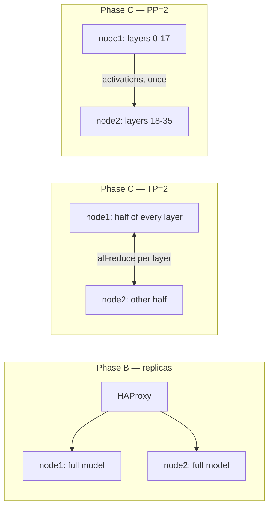

# Phase C — Cross-Node Distributed Serving on Two DGX Sparks

Runbook for serving one model across both DGX Spark nodes as a single logical engine,
and for reproducing the Phase C benchmark. Companion to [multi-node.md](multi-node.md),
which documents the original manual NGC-image procedure.

---

## 1. Purpose and scope

Phases A and B answered two questions. Phase C answers the third.

| Phase | Topology | Question answered |
|---|---|---|
| A | One node, one GPU | Which quantization is fastest? (GPTQ W4A16) |
| B | Two nodes, two independent replicas behind HAProxy | Does scale-**out** help? (yes, 1.39x at C=64) |
| C | Two nodes, one model split across both GPUs | Does scale-**up** help? (no — 1.17x at best, see section 13) |

**Answer up front:** splitting this model across both nodes never beat running two independent
replicas. PP=2 reached 1.17x a single node at C=64 and lost below C=32; TP=2 lost at every
concurrency, landing at 0.55-0.60x. Replication is the correct topology for any model that fits on
one GPU. Full numbers in [section 13](#13-interpreting-the-results).

Phase C covers both distributed backends (Ray and vLLM's Ray-free multiprocessing) and both
split topologies (tensor parallel and pipeline parallel). It deliberately does **not** cover
three-or-more-node topologies, non-GPTQ checkpoints, or layering HAProxy on top of Phase C.

Out of scope but worth stating plainly: a Qwen3-8B W4A16 checkpoint fits comfortably on a single
GB10. Phase C is therefore not a capacity workaround — it is a measurement of what distributing a
model across this specific fabric costs or buys.

---

## 2. Concept primer

### Three ways to use two GPUs

**Replicas (Phase B).** Two complete, independent copies of the model. A load balancer spreads
requests across them. Zero cross-GPU traffic during inference. Scales throughput almost linearly,
but each GPU must hold the whole model, and a single request is never faster.

**Tensor parallel, TP=2 (Phase C).** Each *layer* is split across both GPUs. Every layer's output
requires an **all-reduce** to recombine partial results. For a 36-layer model that is dozens of
collectives per forward pass, each one blocking. On a single node with NVLink this is nearly free.
Across a network it is the dominant cost.

**Pipeline parallel, PP=2 (Phase C).** Layers 0–17 live on node 1, layers 18–35 on node 2. A request
flows through stage 1, crosses the wire **once** carrying only its activation tensor, then flows
through stage 2. Vastly less network traffic than TP. The cost is a pipeline *bubble*: at low
concurrency one GPU idles while the other works. PP needs many in-flight requests to stay busy.



### Why Ray, and when not to use it

vLLM needs to start worker processes on a machine it is not running on, give each a rank, wire up
NCCL, and notice when one dies. Ray is a general-purpose distributed runtime that already solves
exactly that, so vLLM adopted it as the default multi-node backend.

Ray's cost is a second control plane: a head process, a GCS store, per-node raylets, a version that
must match exactly across nodes, and its own failure modes layered under vLLM's.

vLLM 0.28 also ships a Ray-free path. The `mp` backend accepts `--nnodes`, `--node-rank`,
`--master-addr`, and `--master-port`, using plain `torch.distributed` rendezvous instead. The
non-rank-0 node runs with `--headless` — it starts workers and serves no HTTP.

Rule of thumb: Ray if you want autoscaling, heterogeneous placement, or already run a Ray cluster.
`mp` if you have a fixed, known set of nodes and want fewer moving parts. Phase C measures both.

**Measured:** under PP=2 the two backends were indistinguishable (1216.04 vs 1180.02 tok/s at C=64,
inside seed spread). Ray led under TP=2 (178.91 vs 156.90 at C=8) but both lost to a single node, so
the difference had no practical consequence. Ray cost ~30 s of extra bring-up per run for `pip
install` and cluster formation, so `mp` is the better default here. The pipeline-bubble prediction
above held: PP=2 was at its worst relative to a single node at C=2 (0.76x) and improved monotonically
with concurrency.

---

## 3. Hardware and fabric inventory

| Property | Node 1 (head) | Node 2 (worker) |
|---|---|---|
| Hostname | `spark-ce60` | `spark-7bef` |
| Management IP (Wi-Fi) | `192.168.88.8` (`wlP9s9`) | `192.168.88.10` |
| **Fabric IP (QSFP)** | **`192.168.100.11`** (`enp1s0f1np1`) | **`192.168.100.10`** (`enp1s0f1np1`) |
| GPU | NVIDIA GB10 | NVIDIA GB10 |
| Driver | 580.173.02 | 580.173.02 |
| OS / kernel | Ubuntu 24.04 / `7.0.0-1019-nvidia` | Ubuntu 24.04 / `7.0.0-1019-nvidia` |
| Arch | aarch64 | aarch64 |
| RAM / swap | 121 GiB / 15 GiB | 121 GiB / 15 GiB |
| Free disk | ~3.3 TB | ~3.3 TB |
| Docker | 29.2.1, default runtime `runc` | 29.2.1, default runtime `runc` |
| `nvidia-container-cli` | 1.20.0 | 1.20.0 |

### Fabric

| Property | Value |
|---|---|
| Link speed | **200 Gb/s** |
| Ethernet MTU | 1500 |
| RDMA device | `rocep1s0f1` → netdev `enp1s0f1np1` |
| RoCE `active_mtu` | **1024** (`max_mtu` 4096) |
| `link_layer` | Ethernet (RoCE v2, not InfiniBand) |
| RTT | ~0.36 ms QSFP vs ~21 ms Wi-Fi (~58x) |
| NIC | Mellanox vendor `0x02c9`, part `4129`, fw `28.45.4028`, board `NVD0000000087` |

Inactive RDMA ports, for completeness: `rocep1s0f0` (DOWN), `roceP2p1s0f0` (DOWN),
`roceP2p1s0f1` (ACTIVE, netdev `enP2p1s0f1np1` — the second, unused QSFP port).

> **Use IP addresses everywhere.** Hostname resolution is incomplete on both nodes: each host
> resolves only its own name, to `127.0.0.1`. Passing a hostname to Ray or NCCL will silently
> bind the loopback interface and the cluster will never form.

---

## 4. Prerequisites checklist

| # | Requirement | Verify with | Expect |
|---|---|---|---|
| 1 | Passwordless SSH over QSFP | `ssh -o BatchMode=yes nizare@192.168.100.10 true` | exit 0 |
| 2 | Reverse SSH over QSFP | from node 2: `ssh -o BatchMode=yes nizare@192.168.100.11 true` | exit 0 |
| 3 | GPU visible in Docker | `docker run --rm --gpus all nvidia/cuda:13.0.0-base-ubuntu24.04 nvidia-smi -L` | one GB10 |
| 4 | vLLM image present, both nodes | `docker image inspect vllm/vllm-openai:latest` | exit 0 |
| 5 | Checkpoint present, both nodes | `test -d ~/InferenceOptimizer/models/Qwen3-8B-W4A16` | exit 0 |
| 6 | Checkpoint identical | `sha256sum` each of the 7 files on both nodes | digests match |
| 7 | RDMA tooling | `ibv_devinfo -d rocep1s0f1` | `PORT_ACTIVE` |
| 8 | Clocks synced | `timedatectl show -p NTPSynchronized` | `yes` |
| 9 | Both GPUs idle | `nvidia-smi --query-compute-apps=pid --format=csv,noheader` | empty |
| 10 | Container egress to PyPI | `docker run --rm vllm/vllm-openai:latest pip download --no-deps -d /tmp ray` | succeeds |

Item 9 is the one that bites. `run_phase_c.sh` enforces it and aborts with a count of offending
PIDs. Override with `PHASE_C_ALLOW_BUSY_GPU=1` only if you know the resident processes are small.

Note there is **no passwordless sudo** on either node. Anything requiring root — notably MTU
changes — must be typed by a human.

---

## 5. Fabric tuning and the MTU ceiling

> **Moot for the recorded Phase C run.** RDMA could not be initialized at all (section 9), so NCCL
> ran over TCP sockets and `active_mtu` never applied. This section stays because it becomes the
> next lever the moment `nvidia_peermem` is available and `NCCL_IB_DISABLE=0` works.

The link negotiates 200 Gb/s, but the Ethernet MTU is 1500 and RoCE therefore settles on an
`active_mtu` of 1024 bytes against a `max_mtu` of 4096.

Why this matters for TP: an all-reduce of a hidden-state tensor is megabytes. At a 1024-byte RoCE
MTU that is thousands of packets per collective, dozens of collectives per token, and per-packet
overhead dominates. Raising the Ethernet MTU to 9000 lets RoCE negotiate `active_mtu` 4096,
cutting packet count roughly 4x.

This is a deliberate, recorded limitation of the Phase C run. It was **not** changed, because
doing so requires interactive sudo and would invalidate comparison with Phase B, which ran at 1500.

To change it later, on **both** nodes:

```
sudo ip link set enp1s0f1np1 mtu 9000
```

Confirm the Ethernet layer took it:

```
cat /sys/class/net/enp1s0f1np1/mtu          # expect 9000
```

Confirm RoCE renegotiated:

```
ibv_devinfo -d rocep1s0f1 | grep active_mtu # expect 4096 (5)
```

Both ends must match. A one-sided MTU change produces silent black-holing of large frames, which
presents as an NCCL hang rather than an error. Re-run Phase C0 afterwards and re-baseline Phase B
before comparing any numbers.

---

## 6. Ray cluster bring-up

Ray is **not** present in `vllm/vllm-openai:latest`, so it is installed into the running container.

### Do not use upstream `run_cluster.sh` for automation

The upstream helper installs an EXIT trap that removes the container when its shell exits. That is
fine interactively under tmux and fatal under a script. Phase C issues the equivalent `docker run`
itself, detached, via `phase_c_run_prefix` in [../../Compressor/vllm_bench/lib.sh](../../Compressor/vllm_bench/lib.sh).

### Container flags

| Flag | Why |
|---|---|
| `--network host` | Ray and NCCL need real host IPs; NAT breaks rendezvous |
| `--gpus all` | Docker's default runtime is `runc`, not `nvidia` |
| `--ipc host`, `--shm-size=16g`, `-v /dev/shm:/dev/shm` | shared-memory transport between worker processes |
| `--cap-add IPC_LOCK` | pin memory regions, prerequisite for GPUDirect RDMA |
| `--device /dev/infiniband` | exposes the RoCE verbs devices inside the container |
| `--ulimit memlock=-1` | unbounded locked memory for RDMA registration |
| `--ulimit stack=67108864` | NCCL's thread stacks |
| `--entrypoint ''` | the image entrypoint is the API server; we need a shell |

### Environment variables

| Variable | Value | Why |
|---|---|---|
| `VLLM_HOST_IP` | that node's QSFP IP | which address this rank advertises |
| `MASTER_ADDR` | `192.168.100.11` | rank-0 address |
| `NCCL_SOCKET_IFNAME` | `enp1s0f1np1` | bootstrap over QSFP, not Wi-Fi |
| `GLOO_SOCKET_IFNAME` | `enp1s0f1np1` | Gloo control-plane collectives |
| `TP_SOCKET_IFNAME` | `enp1s0f1np1` | vLLM's own tensor-parallel socket |
| `NCCL_IB_HCA` | `rocep1s0f1` | pin to the ACTIVE port; two ports are DOWN |
| `NCCL_IB_DISABLE` | `1` | RDMA is unusable on these nodes; TCP over the same QSFP link (section 9) |
| `NCCL_CUMEM_ENABLE` | `0` | stop NCCL allocating buffers via CUDA VMM |
| `NCCL_CUMEM_HOST_ENABLE` | `0` | stop NCCL allocating host proxy buffers via CUDA VMM |
| `NCCL_MAX_NCHANNELS` | `8` | 64 default channels exhaust RDMA registration |
| `NCCL_BUFFSIZE` | `2097152` | per-channel buffer size |
| `NCCL_DEBUG` | `INFO` | required to read the negotiated transport |
| `NCCL_DEBUG_SUBSYS` | `INIT,NET` | keeps the log readable |
| `RAY_memory_monitor_refresh_ms` | `0` | Ray's OOM killer misreads GB10 unified memory |

Omitting the `*_SOCKET_IFNAME` trio is the single most common failure: NCCL picks the Wi-Fi
interface, and throughput collapses by roughly 58x without any error message.

### Version pinning

Ray refuses to join a cluster whose head runs a different version. Phase C installs Ray on the head
first, reads `ray.__version__`, and pins the worker to that exact version. Never install
independently on both nodes and hope.

### Expected state

```
docker exec phase-c-head ray status
```

should list two nodes under `Active:` and `0.0/2.0 GPU` under `Usage`. Phase C asserts this
programmatically — two alive nodes and `cluster_resources()['GPU'] == 2` — and aborts otherwise,
because a one-node Ray cluster will happily start and then fail confusingly at model load.

---

## 7. Ray-free multiprocessing bring-up

No Ray, no install step, no version pinning. Both nodes run `vllm serve` directly:

- **Head:** `--distributed-executor-backend mp --nnodes 2 --node-rank 0 --master-addr 192.168.100.11 --master-port 29501`
- **Worker:** the same, plus `--node-rank 1 --headless`

`--headless` means the worker starts its engine-core processes and joins the rendezvous but exposes
no HTTP endpoint. All client traffic goes to the head.

Differences from Ray in practice:

- Startup is faster — no GCS, no raylet, no pip install.
- Both sides must be launched within the rendezvous timeout; order does not matter, they wait.
- There is no `ray status` equivalent. Readiness is observed from the head log and `/health`.
- Failure of the worker surfaces as a `torch.distributed` timeout on the head, not a cluster event.

---

## 8. Launching the model

Common arguments, identical to Phases A and B so results stay comparable:

```
vllm serve /model --served-model-name qwen3-8b-gptq --dtype bfloat16 \
  --max-model-len 4096 --gpu-memory-utilization 0.65 --host 0.0.0.0 --port 8000
```

Topology arguments:

| Config | Arguments |
|---|---|
| `ray-tp2` | `-tp 2 -pp 1 --distributed-executor-backend ray` |
| `ray-pp2` | `-tp 1 -pp 2 --distributed-executor-backend ray` |
| `mp-tp2`  | `-tp 2 -pp 1 --distributed-executor-backend mp` + nnodes/node-rank/master |
| `mp-pp2`  | `-tp 1 -pp 2 --distributed-executor-backend mp` + nnodes/node-rank/master |

`--gpu-memory-utilization 0.65` is inherited from Phase A, where node 1's GPU was partly occupied.
It is retained purely for comparability; raising it would invalidate the cross-phase tables.

### Log lines that prove success

| Line | Meaning |
|---|---|
| `GPU KV cache size: N tokens` | engine initialized and KV cache allocated |
| `Maximum concurrency for 4096 tokens per request: Nx` | scheduler sized |
| `compressed-tensors` / `marlin` / `machete` | native W4A16 kernels selected |
| `decompressing model` | **failure** — weights are being expanded to BF16; the gate aborts |

Both `capture_server_facts` and `phase_c_capture_facts` enforce the last two rules.

---

## 9. NCCL transport verification

With `NCCL_DEBUG=INFO`, NCCL announces its chosen transport at init. Grep the head log:

| Log fragment | Verdict | Meaning |
|---|---|---|
| `[send] via NET/IB/GDRDMA` | best | RDMA with GPUDirect; no host bounce buffer |
| `[send] via NET/IB` | good | RDMA, staged through host memory |
| `[send] via NET/Socket` | **degraded** | TCP sockets; RDMA never engaged |
| nothing matching | inconclusive | debug level or subsys filtering is wrong |

`phase_c_capture_facts` performs this classification and writes `nccl-facts.txt` with the verdict on
line 1. A `NET/Socket` verdict does not abort the run — it is recorded, because it is itself a
finding about this fabric.

### Measured outcome on these nodes: RDMA is unusable, sockets are the fallback

The RoCE path was pursued to exhaustion and **does not work on this platform**. The failure is
reproducible and worth recording in full, because every surface-level check passes:

- `rocep1s0f1` is `PORT_ACTIVE`, `link_layer: Ethernet`, `speed=200000`
- NCCL finds and selects it: `NET/IB: [1] rocep1s0f1:uverbs1:1/RoCE provider=Mlx5 speed=200000`,
  then `Using network IB`
- `/dev/infiniband` is exposed, `IPC_LOCK` is granted, `memlock` is `unlimited` in-container
- the host has 93 GiB free and only 24 MiB locked — there is no memory pressure

Initialization nevertheless dies at ring connect:

```
misc/ibvwrap.cc:213 (wrap_ibv_reg_mr_iova2) NCCL WARN Call to ibv_reg_mr_iova2 failed with error Cannot allocate memory
transport/net_ib/reg.cc:81 (ncclIbRegMrDmaBufInternal) -> 2
transport/net.cc:1006 (sendProxyConnect) -> 2
init.cc:1565 (initTransportsRank) -> 2
```

The two lines that explain it:

```
NET/IB : GPU Direct RDMA Disabled for HCA 0 'rocep1s0f1'
Symmetric memory is not supported. cuMemEnable 1, globalGinSupport 0, cuMemGdrSupport 0
NCCL INFO dlvsym failed on mlx5dv_reg_dmabuf_mr - libmlx5.so: undefined symbol: mlx5dv_reg_dmabuf_mr
```

`nvidia_peermem` is not loaded, so GPUDirect RDMA is off and NCCL must stage transfers through a
host-side proxy buffer. But NCCL >= 2.28 allocates even that host buffer through the CUDA VMM
(`cuMem`) allocator and registers it with the NIC via dmabuf — and this image's `libmlx5` has no
`mlx5dv_reg_dmabuf_mr`. The registration therefore cannot succeed by either route, and `ENOMEM`
here means "this memory is not registerable", not "out of memory".

Two mitigations were tested and are retained in `config.sh` because each is independently correct:

| Setting | Effect |
|---|---|
| `NCCL_MAX_NCHANNELS=8`, `NCCL_BUFFSIZE=2097152` | cuts 64 default channels to 8; reduced failures from 24 to 1 |
| `NCCL_CUMEM_ENABLE=0`, `NCCL_CUMEM_HOST_ENABLE=0` | forces legacy host allocation; removes the dmabuf path |

Neither, nor both together, fully clears it — one proxy registration still fails. **`NCCL_IB_DISABLE=1`
is therefore the default**, which routes NCCL over TCP on the same 200 GbE QSFP interface. This is a
transport change only: the traffic still crosses the QSFP link, not Wi-Fi, and the runs are valid
and comparable. `nccl-facts.txt` records `NET/Socket` so no result is silently misattributed.

To retry RDMA on a host where `nvidia_peermem` *is* loaded, set `NCCL_IB_DISABLE=0`. Loading the
module requires root (`sudo modprobe nvidia_peermem`) and was out of scope here — no passwordless
sudo is available on either node.

### Fabric ceiling actually measured

`nccl_probe.py` with `NCCL_MAX_NCHANNELS=8` did complete over RDMA before vLLM's heavier
communicator setup hit the failure above, giving a ceiling for the link:

| Message size | Latency | Bus bandwidth |
|---:|---:|---:|
| 1 MiB | 0.187 ms | 5.21 GiB/s |
| 4 MiB | 0.343 ms | 11.40 GiB/s |
| 16 MiB | 1.271 ms | 12.29 GiB/s |
| 64 MiB | 4.897 ms | 12.76 GiB/s |
| 256 MiB | 19.305 ms | 12.95 GiB/s |

12.95 GiB/s is about 111 Gb/s on a 200 Gb/s link — consistent with a 1024-byte RoCE MTU and
host-staged transfers. Even this best case is roughly two orders of magnitude below the on-package
bandwidth a TP all-reduce would get inside a single GB10, which is the structural reason cross-node
tensor parallelism loses to a single node here.

### Standalone bandwidth probe

[../../Compressor/vllm_bench/nccl_probe.py](../../Compressor/vllm_bench/nccl_probe.py) measures
all-reduce latency and bus bandwidth at 1/4/16/64/256 MiB, independent of vLLM. Run rank 0 in the
head container and rank 1 in the worker container, with `MASTER_ADDR` set to the head's QSFP IP.
Its 256 MiB bus-bandwidth figure is the ceiling any TP configuration can approach.

---

## 10. Running the automated sweep

```
RESULT_ROOT=<run dir> GPU_MEMORY_UTILIZATION=0.65 \
NODE2_HOST=192.168.100.10 HEAD_NODE_IP=192.168.100.11 MN_IF_NAME=enp1s0f1np1 \
Compressor/vllm_bench/run_phase_c.sh gptq
```

| Variable | Default | Purpose |
|---|---|---|
| `NODE2_HOST` | *(required)* | worker QSFP IP |
| `HEAD_NODE_IP` | *(required)* | head QSFP IP |
| `MN_IF_NAME` | *(required)* | fabric interface on both nodes |
| `RDMA_HCA` | `rocep1s0f1` | RDMA device for `NCCL_IB_HCA` |
| `NCCL_IB_DISABLE` | `1` | `1` = TCP over QSFP, `0` = RoCE (see section 9) |
| `NCCL_MAX_NCHANNELS` | `8` | channel count; 64 exhausts RDMA registration |
| `NCCL_BUFFSIZE` | `2097152` | per-channel buffer bytes |
| `NCCL_CUMEM_ENABLE` | `0` | disable CUDA VMM allocator for NCCL buffers |
| `NCCL_CUMEM_HOST_ENABLE` | `0` | disable CUDA VMM allocator for host proxy buffers |
| `PHASE_C_CONFIGS` | `ray-tp2 ray-pp2 mp-tp2 mp-pp2` | which configs to run |
| `PHASE_C_MIN_C1_TPS` | `20` | smoke-gate floor for C=1 output tok/s |
| `PHASE_C_HEALTH_TIMEOUT` | `1800` | seconds to wait for `/health` |
| `PHASE_C_ALLOW_BUSY_GPU` | `0` | set `1` to bypass the idle-GPU precondition |

Flags: `--smoke-only` stops after the gate; `--full-only` skips the gate and sweeps every config.

### Execution model

Each config is brought up, smoke-tested, and torn down before the next begins — they contend for
the same two GPUs. The smoke stage runs concurrency 1 and 8, one seed, 40 prompts. Configs clearing
the gate proceed to the full 7-concurrency x 3-seed sweep, identical to Phases A and B.

The gate exists for economy: a full sweep is roughly 70 minutes per config, so screening first
avoids spending hours on a topology the fabric cannot support.

### Artifact layout

```
<run>/phase_c/
  phase.txt            fabric.txt           gate.txt
  serving_results.csv
  <config>/
    server-head.log      server-worker.log    head-container.log
    server_facts.txt     nccl-facts.txt       ray-status.txt
    launch-head.sh       launch-worker.sh
    smoke/   bench_c*_s*.json  bench_c*_s*.log
    sweep/   bench_c*_s*.json  bench_c*_s*.log
```

`gate.txt` records one line per config with its smoke verdict and per-concurrency throughput —
read this first when interpreting a run.

---

## 11. Teardown and idempotency

`run_phase_c.sh` installs `trap phase_c_teardown EXIT`, which force-removes `phase-c-head` locally
and `phase-c-worker` over SSH. Teardown also runs between configs. It is safe to run repeatedly.

Containers idle on `sleep infinity` and the server is launched into them with `docker exec -d`, so a
vLLM crash leaves the container alive and its logs readable. This is the main diagnostic advantage
over running `vllm serve` as the container's main process.

Verify a clean slate before re-running:

```
docker ps -a --filter name=phase-c --format '{{.Names}}'
ssh nizare@192.168.100.10 "docker ps -a --filter name=phase-c --format '{{.Names}}'"
nvidia-smi --query-compute-apps=pid,used_memory --format=csv,noheader
```

All three should be empty.

---

## 12. Troubleshooting

| Symptom | Likely cause | Fix |
|---|---|---|
| Ray worker never appears in `ray status` | hostname resolved to `127.0.0.1` | pass `--node-ip-address` with the QSFP IP on both sides |
| `ray start` fails with version mismatch | Ray installed independently per node | install on head, read the version, pin the worker to it |
| Throughput ~58x below expectation | NCCL bound to Wi-Fi | set `NCCL_SOCKET_IFNAME`/`GLOO_SOCKET_IFNAME`/`TP_SOCKET_IFNAME` |
| `NET/Socket` in the log | expected default here (`NCCL_IB_DISABLE=1`) | intentional; see section 9. If you want RDMA, set `NCCL_IB_DISABLE=0` and load `nvidia_peermem` |
| `ibv_reg_mr_iova2 failed ... Cannot allocate memory` | no `nvidia_peermem` and no `mlx5dv_reg_dmabuf_mr`, so NCCL's proxy buffer is not registerable — **not** a memory shortage | `NCCL_CUMEM_ENABLE=0`, `NCCL_CUMEM_HOST_ENABLE=0`, `NCCL_MAX_NCHANNELS=8` reduce it; `NCCL_IB_DISABLE=1` eliminates it |
| `Symmetric memory is not supported. cuMemEnable 1 ... cuMemGdrSupport 0` | GPUDirect RDMA off because `nvidia_peermem` is unloaded | `sudo modprobe nvidia_peermem` (needs root), else accept socket transport |
| Raising `memlock`/`IPC_LOCK` does not fix `ENOMEM` | limits were never the constraint | check `Mlocked` in `/proc/meminfo` — if it is tiny, the cause is registerability, not quota |
| Hang at model load, no error | one-sided MTU change, or a DOWN HCA port | match MTU on both ends; pin `NCCL_IB_HCA=rocep1s0f1` |
| `torch.distributed` timeout on head | worker never launched, or `--master-addr` wrong | confirm the worker container is up and the launch script ran |
| `Failed to infer device type` | container started without `--gpus all` | add `--gpus all` |
| `vllm serve --help` shows no flags | help is paginated in 0.28 | use `--help=all` (121 KB, not 4 KB) |
| Port 8000 already in use | a previous run's container survived | run teardown; check both nodes |
| OOM at KV cache allocation | a foreign process holds GPU memory | free it, or lower `--gpu-memory-utilization` |
| `decompressing model` in the log | quantized weights being expanded to BF16 | wrong checkpoint or unsupported kernel path |
| Image ID differs between nodes | `docker save`/`load` rewrites metadata | compare RootFS layer digests, not image IDs |

---

## 13. Interpreting the results

Compare only like with like. All phases share: GPTQ W4A16, `--max-model-len 4096`,
`--gpu-memory-utilization 0.65`, random 512-in/128-out, 200 prompts, 1 warmup, seeds 101/202/303,
median across seeds, client container `vllm/vllm-openai:latest` on `--network host`.

Baselines, output tok/s median:

| C | Phase A (1 node) | Phase B (2 replicas) | B/A |
|---:|---:|---:|---:|
| 1 | 40.14 | 40.68 | 1.013 |
| 2 | 86.54 | 83.69 | 0.967 |
| 4 | 166.89 | 175.28 | 1.050 |
| 8 | 309.09 | 335.23 | 1.085 |
| 16 | 531.36 | 611.38 | 1.151 |
| 32 | 803.63 | 1008.14 | 1.254 |
| 64 | 1041.95 | 1446.19 | 1.388 |

### Measured Phase C results

Output tok/s, median of three seeds, 84 runs, zero failed requests:

| C | 1 node | 2 replicas | PP=2 ray | PP=2 mp | TP=2 ray | TP=2 mp |
|---:|---:|---:|---:|---:|---:|---:|
| 1 | 40.14 | 40.68 | 40.20 | 39.48 | 30.17 | 27.44 |
| 2 | 86.54 | 83.69 | 65.38 | 65.00 | 57.02 | 46.75 |
| 4 | 166.89 | 175.28 | 135.93 | 142.13 | 119.42 | 105.80 |
| 8 | 309.09 | 335.23 | 275.54 | 275.69 | 178.91 | 156.90 |
| 16 | 531.36 | 611.38 | 497.08 | 493.36 | 310.30 | 298.69 |
| 32 | 803.63 | 1008.14 | 822.34 | 820.20 | 489.00 | 452.16 |
| 64 | 1041.95 | **1446.19** | 1216.04 | 1180.02 | 595.71 | 598.93 |

What the numbers settled, against the predictions above:

- **Replication wins outright.** Phase B leads at every concurrency from 4 upward and is 1.39x a
  single node at C=64. No split topology came close.
- **PP=2 only pays above C=32** (1.02x), reaching 1.17x at C=64. Below that it is a net loss — worst
  at C=2 (0.76x), where the pipeline is starved.
- **TP=2 never wins.** It sits at 0.55–0.60x from C=8 upward. The prediction that C=1 would be its
  worst case was wrong: C=1 is actually its *best* relative showing (0.75x), because at C=1 there is
  no batching for the all-reduce cost to compete against. The penalty deepens once concurrency rises.
- **TTFT was the reverse of what was predicted.** PP=2 does not raise TTFT — it produced the best
  median TTFT of any topology (223.3 ms at C=64 vs 304.8 single-node and 536.5 two-replica), and
  beat a single node at every C from 2 up. Each stage holds half the layers, so per-node prefill
  compute halves; that outweighs the one inter-stage hop.
- **TPOT confirmed the TP diagnosis.** TP=2 TPOT is 94.96 ms at C=64 versus 43.27 ms for PP=2 and
  53.27 ms single-node — a direct readout of per-token network cost.
- **Executor backend barely matters.** PP=2 ray vs mp differ by ~3% at C=64, inside seed spread. Ray
  leads under TP (178.91 vs 156.90 at C=8) but both lose, so it is moot. Ray adds ~30 s of bring-up
  per run, so `mp` is the better default.

Caveats to carry into any writeup: NCCL ran over TCP sockets, not RDMA (section 9), so TP=2 is
penalised more than a working RoCE path would penalise it — though a 2x structural gap is unlikely
to close; MTU 1500 / `active_mtu` 1024 caps fabric efficiency; utilization is pinned at 0.65 rather
than a tuned value; three Jupyter kernels held ~17 GiB on node 1 throughout, matching Phase A/B
conditions; and the model fits on one GPU, so Phase C measures the *cost* of splitting rather than
the *necessity* of it. A 70B model that genuinely cannot fit on one device would invert the framing
entirely — there, PP=2 is the recommendation, not the counterexample.

---

## 14. Reproduction appendix

| Component | Pinned value |
|---|---|
| Server & client image | `vllm/vllm-openai:latest` |
| vLLM | 0.28.0 |
| PyTorch | 2.13.0+cu130 |
| CUDA | 13.0 |
| Ray | resolved from `ray[cgraph]` on the head, then pinned to the worker |
| Model | `models/Qwen3-8B-W4A16` (GPTQ W4A16), 6,082,884,728 bytes across 7 files |
| Served name | `qwen3-8b-gptq` |
| Run root | `Compressor/benchmark_results/vllm_20260913T000908Z/phase_c/` |

The NGC image `nvcr.io/nvidia/vllm:26.05-py3` referenced by [multi-node.md](multi-node.md) was
deliberately **not** used: it is absent on both nodes, `nvcr.io` returns HTTP 401 without
credentials, and its different vLLM version would break comparison with Phases A and B.

Scripts: [run_phase_c.sh](../../Compressor/vllm_bench/run_phase_c.sh),
[lib.sh](../../Compressor/vllm_bench/lib.sh),
[config.sh](../../Compressor/vllm_bench/config.sh),
[bench_one.sh](../../Compressor/vllm_bench/bench_one.sh),
[collect.py](../../Compressor/vllm_bench/collect.py),
[nccl_probe.py](../../Compressor/vllm_bench/nccl_probe.py).
